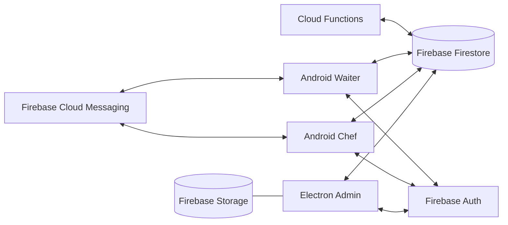
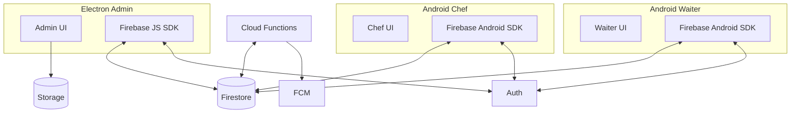
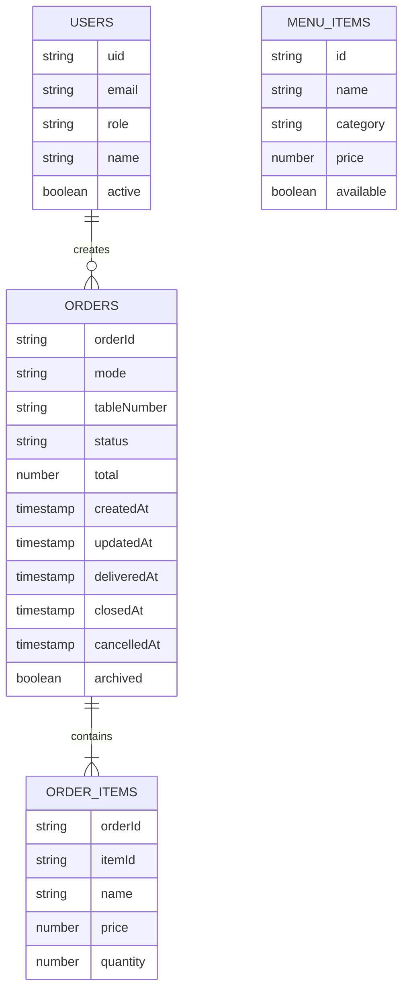
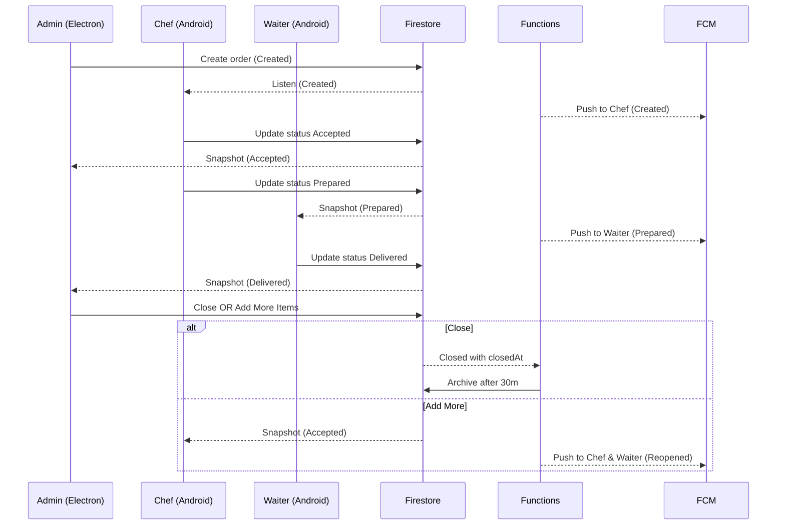
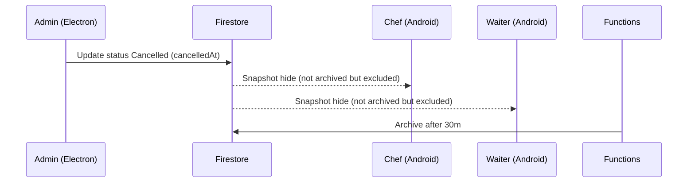
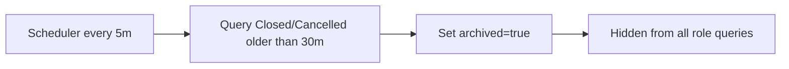

### ROMS – Technical Architecture (Mermaid-ready)

Paste into a Mermaid editor to export PNG.

## Context Diagram

## Component Diagram

## Simplified ERD (logical)

## Status Transition Sequence

## Cancel Flow Sequence

## Auto-Archive Job (Functions)

